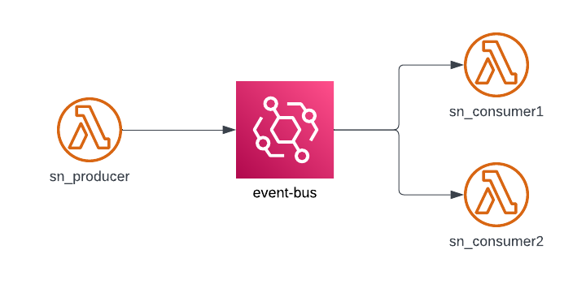

# eb-prod-cons
El proyecto genera una instancia de EventBridge llamada event-bus. Además, se generan 3 lambdas, un productos y 2 consumidores.
* El productor genera un evento el cual es consumido y procesado por los consumidores de forma independiente.
* El consumer1 simula transferir los puntos del cliente al aliadito.
* El consumer2 simula transferir los puntos del aliadito al cliente.

## Arquitectura


Evento ocupado en la prueba
```json
{
  "version": "0",
  "id": "UUID",
  "detail-type": "transaction.persisted",
  "source": "sn.app",
  "account": "598341739583",
  "time": "timestamp",
  "region": "us-east-1",
  "resources": [],
  "detail": {
    "aliadito": {
        "ciam": "autth0|aa35232bd3"
    },
    "store": {
        "id": "37",
        "name": "Abarrotes Don Pedro"
    },
    "client": {
        "premia_card": "1111222233334444",
        "telephone": "5534539926"
    },
    "transactions": [{
        "payment_type": "EF",
        "total": 200.00,
        "points_to_aliadito": 0,
        "points_to_client": 40
        },
        {
        "payment_type": "PP",
        "total": 300.00,
        "points_to_aliadito": 3000,
        "points_to_client": 0
        }
    ],
    "total": 500.00,
    "points_to_aliadito": 3000,
    "points_to_client": 40,
    "payment_concept": "Mandado"
  }
}
```